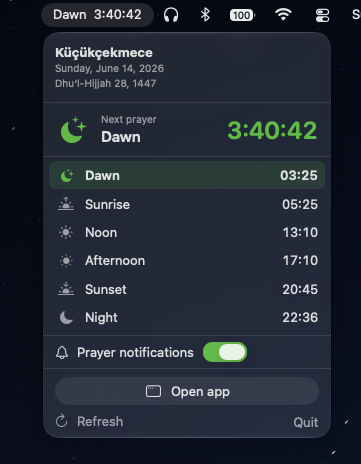
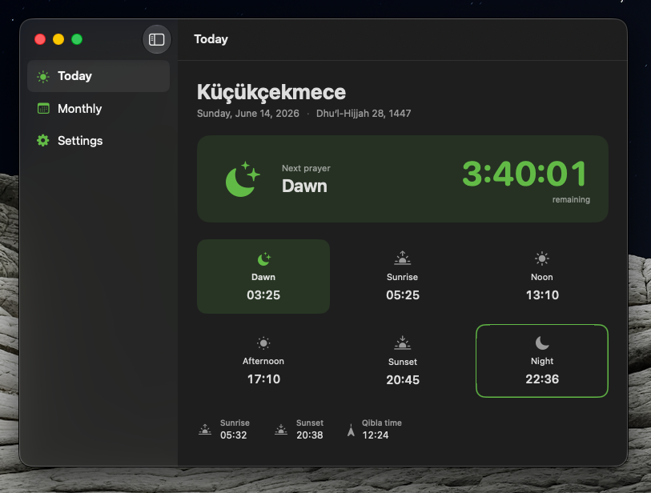
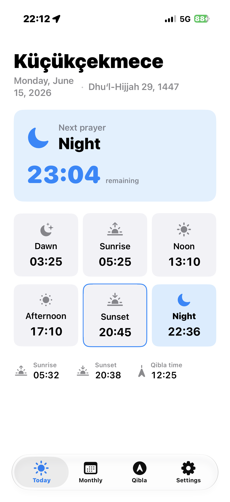
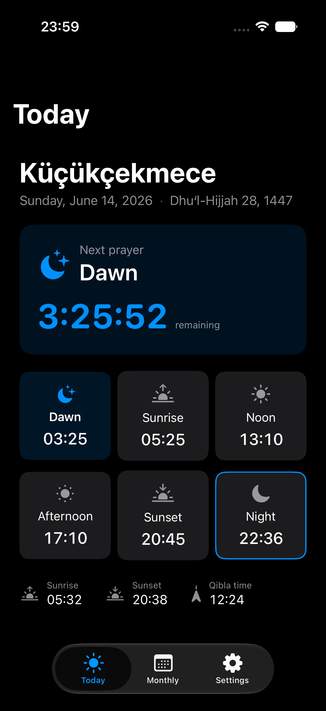
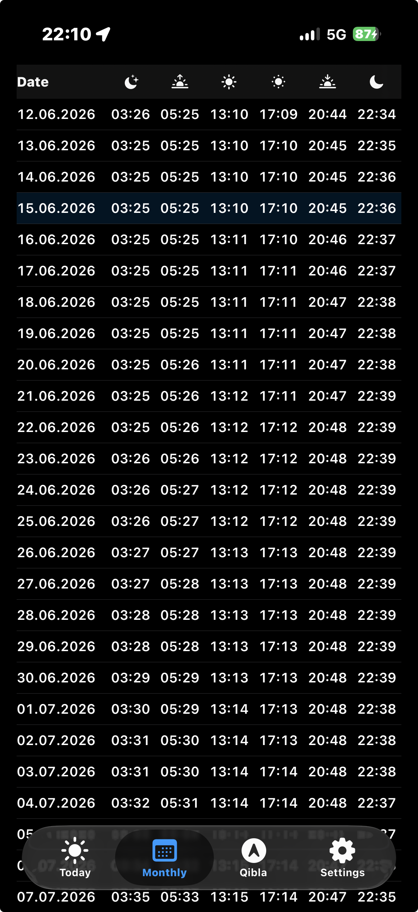
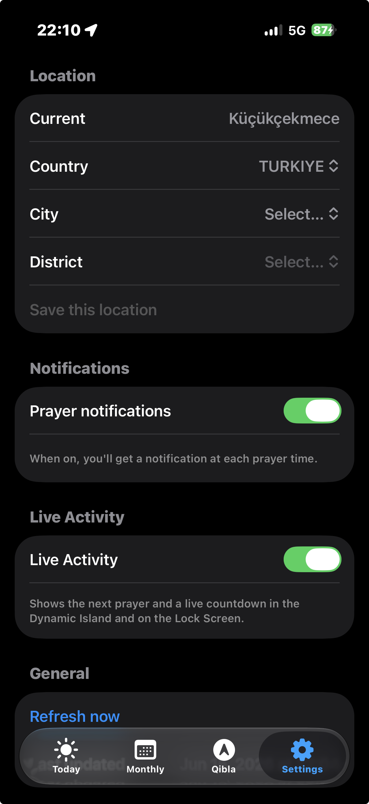
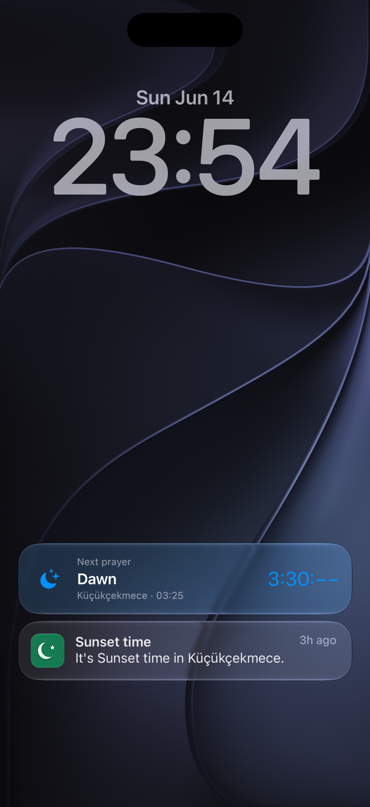
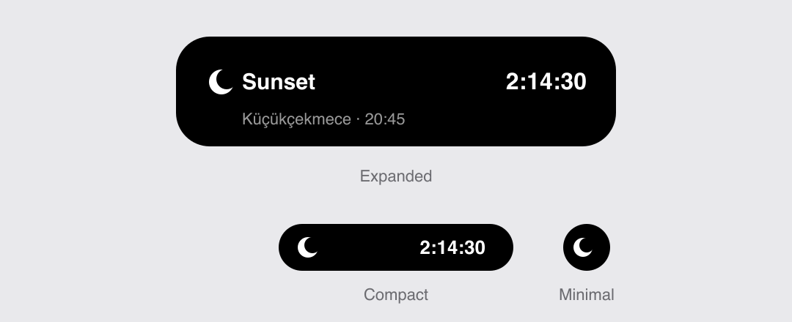
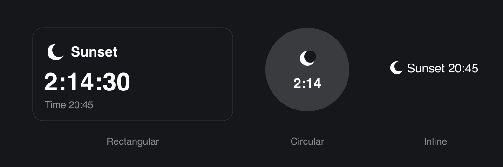

<div align="center">


# 🕌 Namaz Vakti

**Native macOS (menu bar) and iOS apps for Muslim prayer times — powered by the Turkish
Directorate of Religious Affairs (Diyanet).**

[](https://github.com/olcayertas/prayer-time/actions/workflows/ci.yml)


[](LICENSE)

</div>

---

On **macOS**, Namaz Vakti lives in your menu bar with a live countdown to the next prayer and
opens into a full window for more detail. On **iOS**, it's a tabbed app (Today / Monthly /
Settings). Both are built from the same Core logic and the same SwiftUI views.

## 📸 Screenshots

### macOS

|  Menu bar  |  Main window  |
| :--------: | :-----------: |
|  |  |

### iOS

|  Today  |  Today (dark)  |  Monthly  |  Settings  |
| :-----: | :------------: | :-------: | :--------: |
|  |  |  |  |

### Lock Screen, Live Activity & Dynamic Island

The next-prayer **Live Activity** and a **prayer-time notification**, live on the Lock Screen:



**Dynamic Island** — the same Live Activity, compact / minimal / expanded _(preview)_



**Lock Screen widgets** — rectangular, circular, and inline accessory families _(preview)_



> The Dynamic Island and Lock Screen-widget images are previews — those surfaces don't render
> into headless Simulator captures (the Lock Screen shot above is a real-device capture).

## ✨ Features

- **Menu bar countdown** — the next prayer with a live, jitter-free countdown (e.g. `Afternoon  1:23:45`).
- **Dropdown panel** — today's six times with the next one highlighted, location, and the
  Gregorian + Hijri date.
- **Main window** (macOS) — sidebar with **Today** (rich view), **Monthly** (table), and
  **Settings**. A Dock icon appears only while the window is open.
- **iOS app** — the same Today / Monthly / Settings as a tab bar, with a responsive Today hero
  and a compact, icon-headed month table tuned for phone widths.
- **Home Screen widget** — small / medium WidgetKit widget with the next prayer and a live countdown.
- **Lock Screen widgets** (iOS) — rectangular, circular, and inline accessory families.
- **Dynamic Island & Live Activity** (iOS) — a user-toggled next-prayer countdown in the
  Dynamic Island (compact / minimal / expanded) and on the Lock Screen.
- **App icon** — a flat crescent & star, shipped for both apps.
- **Notifications** — optional local notifications at each prayer time.
- **Location picker** — country → city → district, remembered across launches.
- **Localized** — English, Turkish, and Arabic (right-to-left), including the app name and
  locale-aware Gregorian + Hijri dates. [Adding a language →](docs/LOCALIZATION.md)
- **Accessibility** — full Dynamic Type scaling (including the hero countdown) and automatic dark mode.

## 📋 Requirements

- macOS 14 (Sonoma) or later, and/or iOS 17 or later
- Xcode 26+ to build
- [XcodeGen](https://github.com/yonaskolb/XcodeGen) — `brew install xcodegen`

## 🚀 Build & run

```sh
brew install xcodegen
xcodegen generate                       # regenerate NamazVakti.xcodeproj from project.yml
xcodebuild -scheme NamazVakti -destination 'platform=macOS' \
  -derivedDataPath build/DerivedData build
open build/DerivedData/Build/Products/Debug/NamazVakti.app
```

For **iOS**, build for the Simulator and launch it on a booted device:

```sh
xcodebuild -scheme NamazVaktiiOS -destination 'generic/platform=iOS Simulator' \
  -derivedDataPath build/DerivedData build
xcrun simctl install booted build/DerivedData/Build/Products/Debug-iphonesimulator/NamazVaktiiOS.app
xcrun simctl launch booted com.olcayertas.NamazVakti.iOS
```

Run the tests (pure schedule + decoding logic, no network):

```sh
xcodebuild test -scheme NamazVakti -destination 'platform=macOS' -derivedDataPath build/DerivedData
```

Uses **local ad-hoc signing** — no Apple Developer account required. Re-run
`xcodegen generate` whenever you add or remove source files.

## 🧭 Data source

Prayer times come from the no-auth **EzanVakti** wrapper of Diyanet's published tables:

```
GET https://ezanvakti.emushaf.net/vakitler/{districtId}   # one call = a full month
```

The hierarchy endpoints (`/ulkeler`, `/sehirler/{id}`, `/ilceler/{id}`) drive the location
picker. Everything goes through a `PrayerTimesProvider` protocol, so the official Diyanet
`AwqatSalah` API can be dropped in later without touching the UI.

## 🏗️ Architecture

- **`Sources/Core`** — UI-free, shared by every target:
  `PrayerDay`, `PrayerSchedule` (next-prayer math in `Europe/Istanbul`), `PrayerCache`,
  `PrayerTimesProvider` / `PlacesProvider` (EzanVakti), `PrayerStore`, `NotificationScheduler`,
  and the shared `Localizable.xcstrings`.
- **`Sources/Shared`** — cross-platform SwiftUI used by both apps: the Today / Monthly / Settings
  views, the location picker, `DateLocalizer` (locale-aware Gregorian + Hijri dates), and a
  `Color.cardBackground` shim. Today's hero and the month table adapt to compact (phone) widths.
- **`Sources/App`** (macOS) — `MenuBarExtra` menu bar item + the `MainWindowView` sidebar shell.
- **`Sources/iOS`** (iOS) — `PrayerTimesApp` entry point + `RootTabView` tab bar.
- **`Sources/Widget`** — WidgetKit timeline provider and views (Home Screen + iOS Lock Screen
  accessory families), built into both the macOS and iOS widget extensions.
- **`Sources/LiveActivity`** (iOS) — the ActivityKit attributes and the Live Activity / Dynamic
  Island UI, shared by the iOS app and its widget.

### Notable decisions

- **No App Group** (avoids needing a paid Apple Developer account) — the app and the widget
  each cache their own monthly JSON.
- **Swift 6 language mode** with complete strict concurrency. Networking is `async`/`await`
  (`URLSession.data(from:)`) behind a `Sendable` `PrayerTimesProvider`; the `@MainActor`
  `PrayerStore` awaits it from a cancellable `Task`, and a structured `Task` (not a GCD timer)
  drives the once-a-second countdown.
- The menu bar uses a **plain `String` title with monospaced digits**: a rendered
  `MenuBarExtra` label hangs AppKit's status-item sizing on macOS 26. (This — not async/await —
  was the real cause of an earlier hang, so the data layer is free to use modern concurrency.)
- **Localized via String Catalogs** (English source · Turkish · Arabic with RTL) — including the
  app/widget names and locale-aware Gregorian + Hijri dates. See [docs/LOCALIZATION.md](docs/LOCALIZATION.md).

## 🗺️ Roadmap

- Official Diyanet `AwqatSalah` provider
- Location-aware widget (per-widget configuration)
- [More languages](docs/LOCALIZATION.md) — prioritized by Muslim population
- Launch at login (macOS); localized Live Activity / Settings strings

## 📄 License

Released under the [MIT License](LICENSE) © 2026 Olcay Ertaş.

Prayer-time data © T.C. Diyanet İşleri Başkanlığı, accessed via the community EzanVakti
service. This project is not affiliated with or endorsed by Diyanet.
